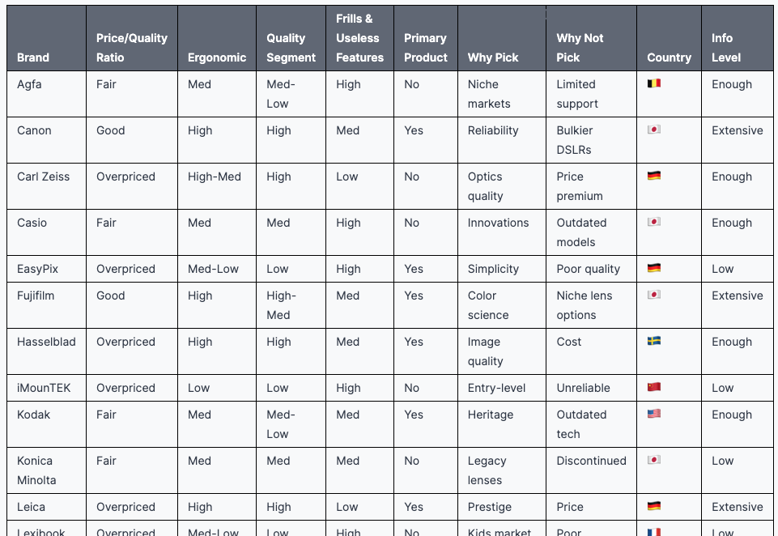
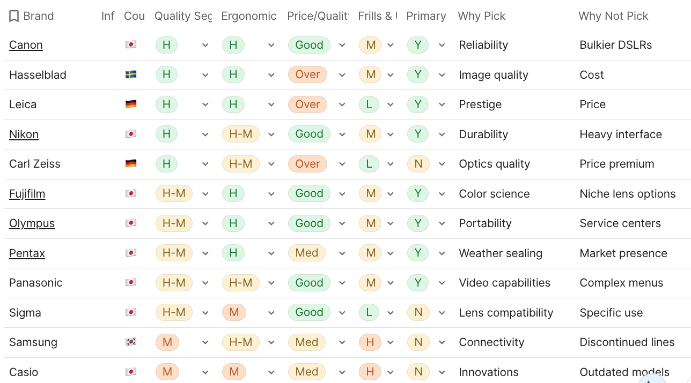

# Compare brands


To decide between products

## Prompt template

```
Act as: {{ expert }}, Sharp person, Extreme realist, Extreme Cynic. Tone: extremely super brief as brief as possible, concentrated, rule of thumb, professional jargon, scientific, rich in facts
Add related emojis
Response language: English (C1/C2 lexic)
Task: For each brand specify about their {{ product_type }}: 1) price/quality ratio (realistically, cynic, options: good, fair, overpriced) 1) {{ secondary_metric }}  (realistically, cynic, options: High, High-Med, Med, Med-Pure, Pure) 1) quality segment (options: High, High-Med, Med, Med-Pure, Pure) 1) how many frills and useless features is has (realistically, cynic, options: High, Med, Low)
 1) how primary/target is this product for this brand or it's just a side product with it's branding (yes - if primary, no - if side) 1) why to pick it, except price/availability (realistically, cynic, non obvious) 1) why not to pick it, except price/availability (realistically, cynic, non obvious) 1) country of origin (as emoji flag) 1) how enough information you have on this brand for the analysis to address any doubts (realistically, cynic, options: low, enough, extensive)

Brands: 
{{ brands }} 

Format as table (each parameter as column, brand as row)
Once finished answer type 'FIN'
```


Parameters:  
`{{ expert }}` - Target area (e.g. `Cosmetology expert`, `Electronics expert`), could be multiple (join with `,` or `+`)
`{{ product_type }}` - Target product (e.g. `Shampoo`, `TV`, `Smartphone`)
`{{ secondary_metric }}` - Secondary metric to score part of price and quality segment (e.g. `healthiness`, `ergonomics`) 
`{{ brands }} ` - list of brands, one per line

!IMPORTANT! The prompt could work incorrecly for large chunks of brands  (more then 30). If you need to do so, add to the end of prompt `Respond for 20 first` and after getting a chunk of response, prompt again with `Proceed starting with {{ starting_with }}` where `{{ starting_with }}` will be the name of last brand from the last GPT answer, this way you'll be able to iterate over the whole list of brands

## Result



or as the final decision making table with colors and sort applied (e.g. in Coda): 


