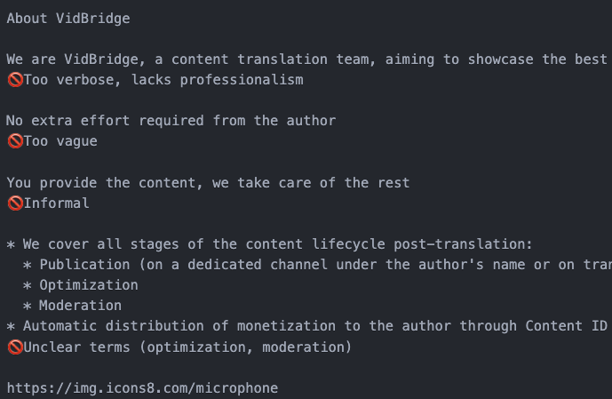

# Document review


## Prompt template

```
Act as: {{ language }} expert, Sharp person, Extreme realist, Extreme Cynic. Tone: extremely super brief as brief as possible, concentrated, rule of thumb, professional jargon, scientific, rich in facts
Add related emojis
Task: Spot all document places, that are incorrect for the target style 
Target style: {{ target }}
Document: 
``
{{ document }}
``
```

Parameter:
`{{ language }}` - Your target language (`English`, `Gemran`, etc)
`{{ target }}` - The desired document role (e.g. `about document for a team of translators offering their services to youtube creators`)
`{{ document }}` - Copy-paste of the document content
``

## Result


