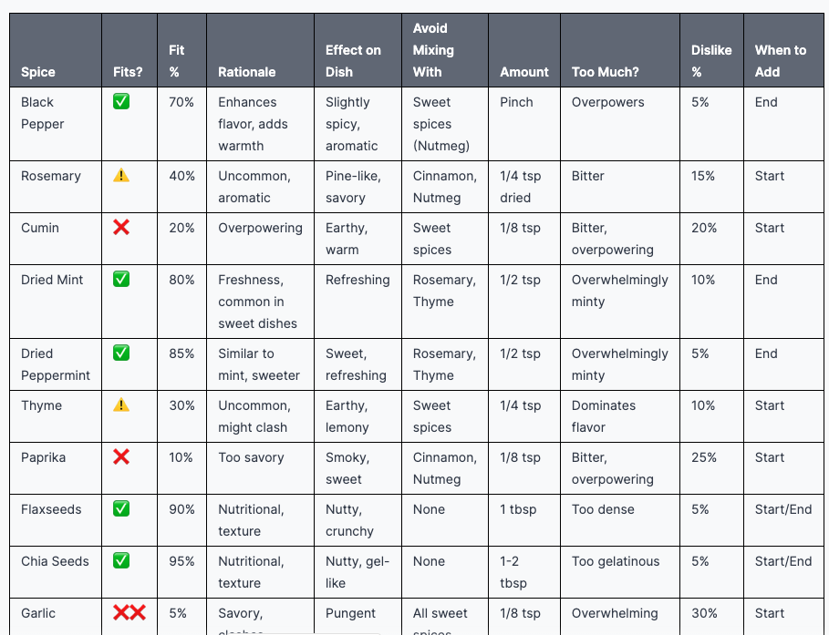

# Spices fit

For cooking. Lists fit of each spice to target dish

## Prompt template

```
Act as: Cooking expert, Spices expert, Sharp person, Extreme realist, Extreme Cynic. Tone: extremely super brief as brief as possible, concentrated, rule of thumb, professional jargon, scientific, rich in facts
Add related emojis
Response language: English (C1/C2 lexic)
Task: For each специя specify: 1) it's fits with target product for the most people (✅ for "fits for sure" or ⚠️ for "niche/experimental" or ❌ for "most probably will not fit" or ❌❌ for "definitely not") 1) it's fit with target product (in percent) 1) rationale 1)  the resulting effect on dish 1) wit which spices with good fit ("fits for sure" category) it's better not to mix, why 1) the amount of this spice it's better to apply 1) what will happen if applied too much  1) percent of people dislikes it 1) when to add it (at which phase of cooking) 

Target product/dish: {{ dish }} 

Spices: 
- Black paper
- Rosemary
- Cumin 
- Dried Mint
- Dried Peppermint
- Thyme
- Paprika 
- Flaxseeds
- Chia seeds
- Garlic 
- Parsley
- Dill
- Nutmeg 
- Basil
- Bay leaf
- Caraway
- Turmeric
- Star Anise
- Cinnamon
- Coriander
- Ginger
- Oregano
- Coconut flakes


Format as table 
Finally also specify level of threshold for fit, could be considered: Enough, Good 
Once finished response, type "FIN"
```


Parameters:  
`{{ dish }}` - Target dish you want to cook


## Result


